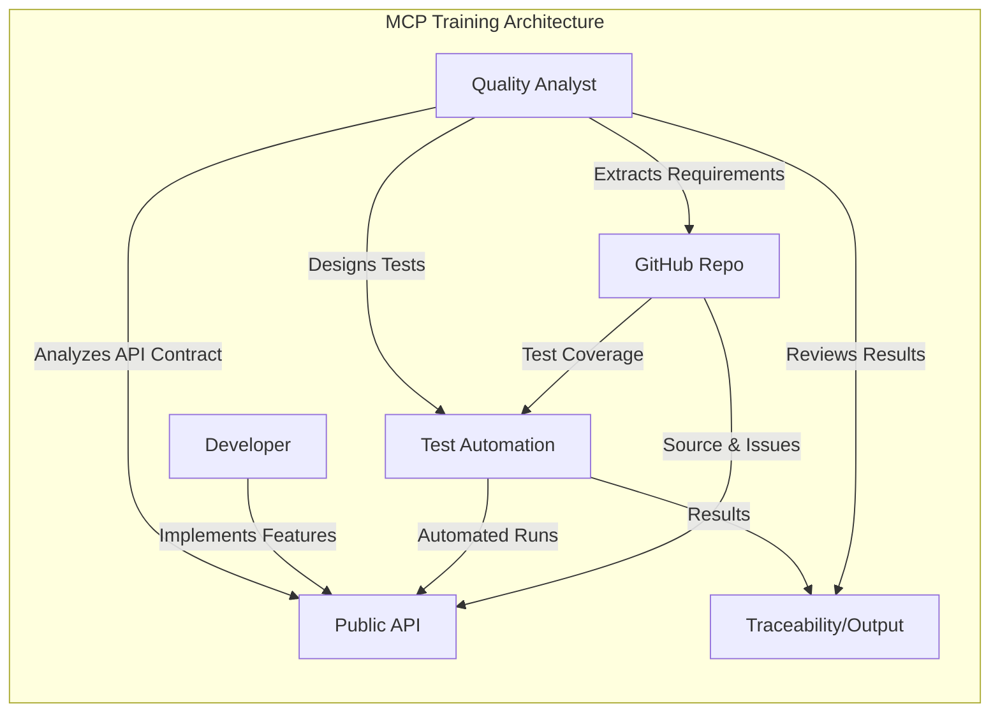

# MCP Training Project

## What is MCP Training?
This project is designed to help you learn and implement Model Context Protocol (MCP) concepts for quality control, automation, and API testing. The training is hands-on, step-by-step, and uses public APIs and open-source tools so you can practice and build real skills.

## Training Structure
The training is divided into clear sections, each with its own guide and practical exercises:

1. **Requirements Analysis**
   - Learn to extract and analyze requirements from public issue trackers (e.g., GitHub Issues).
2. **API Contract Extraction**
   - Understand and document API contracts using OpenAPI/Swagger from public APIs.
3. **Test Coverage Review**
   - Review existing tests and identify gaps using public repo examples.
4. **Test Design & Documentation**
   - Design and document test cases for APIs and UI workflows.
5. **Automation Implementation**
   - Build and run automated tests using Python and open-source frameworks.
6. **Review & Traceability**
   - Validate coverage, review results, and ensure traceability.

## Visual Overview: Training Goals & Architecture

This diagram shows how the MCP training connects requirements, API contracts, test design, automation, and traceability across roles and tools.

## How to Use This Project
- Each section has its own markdown file in the docs/ folder.
- Follow the guides step by step.
- Use the provided scripts and examples.
- All output and artifacts are saved in the out/ folder for traceability.

## Next Steps
- Start with [docs/requirements_analysis.md](docs/requirements_analysis.md) for the first topic.
- Progress through each section, building your MCP skills end to end.

---

> This project is designed for both beginners and experienced engineers. All steps are explained in detail, with links to further reading and practical examples.
